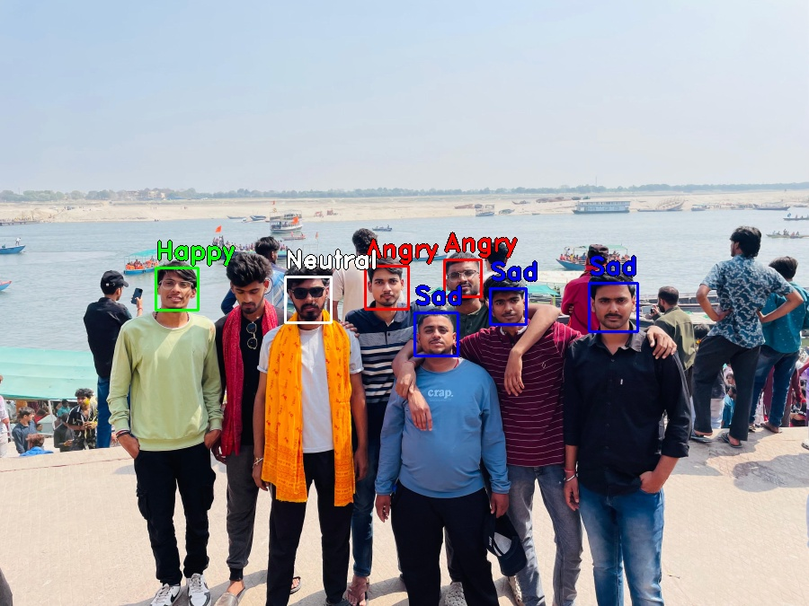
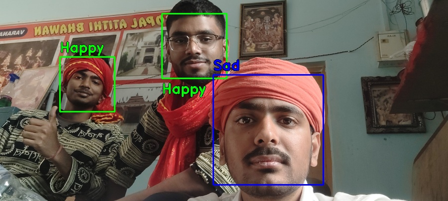

<div align="center">
  <h1>🎭 Real-Time Emotion Recognition AI</h1>
  <p><i>Developed with passion by <b>Pritam Kumar</b></i></p>
  
  <br>
  <a href="https://emotion-detection-ai-nwfybvjapxbs5jhbtpd4cy.streamlit.app" style="text-decoration: none;">
    <div style="
      display: inline-block;
      padding: 15px 40px;
      font-size: 20px;
      font-family: 'Courier New', Courier, monospace;
      font-weight: bold;
      color: #ffffff;
      background-color: #1e2130;
      border: 2px solid #ff4b4b;
      border-radius: 10px;
      box-shadow: 0 8px #ff4b4b;
      cursor: pointer;
      transition: all 0.2s ease;
      text-transform: uppercase;
      letter-spacing: 2px;">
      [ CLICK TO PREVIEW THE SYSTEM ]
    </div>
  </a>
  <p style="margin-top: 20px; color: #888;"><i>Best experienced on Desktop & Mobile</i></p>
  <br>
  <strong>A high-fidelity Deep Learning application optimized for real-time and group facial analysis.</strong>
</div>

<hr>

<div align="center">
  <a href="https://www.linkedin.com/in/pritam-kumar-607631334?utm_source=share&utm_campaign=share_via&utm_content=profile&utm_medium=android_app">🔗 LinkedIn</a> • 
  <a href="https://www.instagram.com/pritamray26">📸 Instagram</a> • 
  <a href="mailto:pritamray6200@gmail.com">📧 Email</a>
</div>

<hr>

<h2 id="showcase">📸 Project Showcase</h2>
<p align="center">
  <table width="100%" style="border-collapse: collapse;">
    <tr>
      <td width="33%" align="center" style="padding: 10px;">
        <div style="border: 1px solid #333; border-radius: 10px; padding: 10px; background: #161b22;">
          <b>Real-Time Live Feed</b><br><br>
          
        </div>
      </td>
      <td width="33%" align="center" style="padding: 10px;">
        <div style="border: 1px solid #333; border-radius: 10px; padding: 10px; background: #161b22;">
          <b>Group Photo Analysis</b><br><br>
          
        </div>
      </td>
      <td width="33%" align="center" style="padding: 10px;">
        <div style="border: 1px solid #333; border-radius: 10px; padding: 10px; background: #161b22;">
          <b>High-Res Uploads</b><br><br>
          
        </div>
      </td>
    </tr>
  </table>
</p>

<hr>


<h2 id="technical-details">🧠 Technical Implementation</h2>
<ul>
  <li><b>Model Architecture:</b> The system utilizes a custom <b>Convolutional Neural Network (CNN)</b> stored in <code>emotion_detection.h5</code>. The model was trained to classify facial expressions into 5 distinct categories using deep feature extraction layers.</li>
  <li><b>Facial Localization:</b> Object detection is handled via <code>haarcascade_frontalface_default.xml</code>. This Haar-Cascade classifier identifies the Region of Interest (ROI) within a frame before passing it to the neural network.</li>
  <li><b>Input Pipeline:</b> Raw image data undergoes a multi-stage preprocessing sequence: Grayscale conversion, <b>CLAHE</b> (Contrast Limited Adaptive Histogram Equalization) for feature enhancement, and 48x48 pixel resizing to match the model's input tensor.</li>
  <li><b>Inference Engine:</b> Real-time video processing is powered by <b>WebRTC</b>, enabling high-frequency frame analysis and low-latency feedback between the browser and the Python backend.</li>
  <li><b>Backend Stack:</b> The core logic is built with <b>TensorFlow</b> for model inference and <b>OpenCV</b> for computer vision operations, all integrated into a <b>Streamlit</b> interface.</li>
</ul>


<hr>

<h2 id="technical-stack">🛠️ Technical Stack</h2>

<table width="100%">
  <tr>
    <td width="30%"><b>Deep Learning</b></td>
    <td>TensorFlow, Keras (CNN Architecture), FER2013 Dataset</td>
  </tr>
  <tr>
    <td><b>Computer Vision</b></td>
    <td>OpenCV (Haar-Cascade Classifiers)</td>
  </tr>
  <tr>
    <td><b>Web Framework</b></td>
    <td>Streamlit, Streamlit-WebRTC</td>
  </tr>
  <tr>
    <td><b>Language</b></td>
    <td>Python 3.10+</td>
  </tr>
</table>

<hr>

<h2>⚙️ Setup Instructions</h2>

```bash
# Clone the repository
git clone [https://github.com/YOUR_USERNAME/emotion-detection-ai.git](https://github.com/YOUR_USERNAME/emotion-detection-ai.git)

# Install dependencies
pip install -r requirements.txt

# Launch the app
streamlit run app.py
